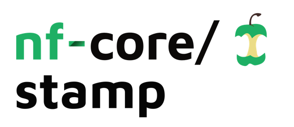
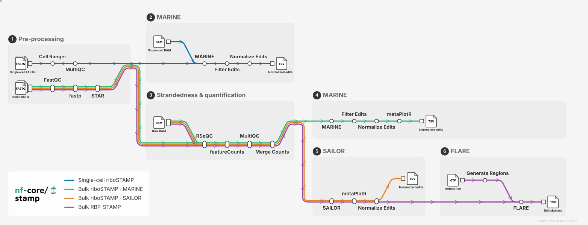

<h1>
  <picture>
    <source media="(prefers-color-scheme: dark)" srcset="docs/images/nf-core-stamp_logo_dark.png">
    
  </picture>
</h1>

[](https://github.com/codespaces/new/nf-core/stamp)
[](https://github.com/nf-core/stamp/actions/workflows/nf-test.yml)
[](https://github.com/nf-core/stamp/actions/workflows/linting.yml)[](https://nf-co.re/stamp/results)[](https://doi.org/10.5281/zenodo.XXXXXXX)
[](https://www.nf-test.com)

[](https://www.nextflow.io/)
[](https://github.com/nf-core/tools/releases/tag/4.0.2)
[](https://docs.conda.io/en/latest/)
[](https://www.docker.com/)
[](https://sylabs.io/docs/)
[](https://cloud.seqera.io/launch?pipeline=https://github.com/nf-core/stamp)

[](https://nfcore.slack.com/channels/stamp)[](https://bsky.app/profile/nf-co.re)[](https://mstdn.science/@nf_core)[](https://www.youtube.com/c/nf-core)

## Introduction

**nf-core/stamp** is a bioinformatics pipeline for analysing [STAMP](https://doi.org/10.1038/s41592-021-01128-0) (Surveying Targets by APOBEC-Mediated Profiling) experiments, in which an RNA base editor deposits C-to-U (or A-to-I) edits on the transcripts it contacts. It takes a samplesheet of FASTQ or aligned BAM files, calls edit sites, filters them against dbSNP and gene annotation, normalises them to expression, and summarises their metagene distribution.

The pipeline covers three assay designs from a single entry point:

- **Ribo-STAMP** (bulk) — ribosome association, quantified as edits per gene normalised to expression.
- **RBP-STAMP** (bulk) — RBP binding sites, called as edit clusters with [FLARE](https://doi.org/10.1186/s12859-023-05452-4).
- **Single-cell STAMP** — per-cell edit calls from 10x Genomics libraries.

<picture>
  <source media="(prefers-color-scheme: dark)" srcset="docs/images/stamp_metro_animated_dark.svg">
  
</picture>

> In case the image above is not loading, please have a look at the static version ([light](docs/images/stamp_metro_light.svg) / [dark](docs/images/stamp_metro_dark.svg)) or the interactive version ([light](docs/images/stamp_metro_light.html) / [dark](docs/images/stamp_metro_dark.html)).

1. Read QC ([`FastQC`](https://www.bioinformatics.babraham.ac.uk/projects/fastqc/))
2. Adapter and quality trimming ([`fastp`](https://github.com/OpenGene/fastp))
3. Alignment ([`STAR`](https://github.com/alexdobin/STAR)) or [`Cell Ranger`](https://www.10xgenomics.com/support/software/cell-ranger) for single-cell
4. Strandedness inference ([`RSeQC`](https://rseqc.sourceforge.net/))
5. Edit calling ([`MARINE`](https://github.com/YeoLab/MARINE)), optionally also [`SAILOR`](https://github.com/YeoLab/FLARE)
6. Gene quantification ([`featureCounts`](https://subread.sourceforge.net/))
7. Edit filtering (multiallelic, dbSNP, editing fraction, annotation) and normalisation to expression
8. Metagene distribution of edit sites ([`metaPlotR`](https://github.com/olarerin/metaPlotR))
9. Edit-cluster identification for RBP-STAMP ([`FLARE`](https://github.com/YeoLab/FLARE), opt-in via `--run_flare`)
10. Aggregate QC report ([`MultiQC`](http://multiqc.info/))

## Usage

> [!NOTE]
> If you are new to Nextflow and nf-core, please refer to [this page](https://nf-co.re/docs/get_started/environment_setup/overview) on how to set-up Nextflow. Make sure to [test your setup](https://nf-co.re/docs/get_started/run-your-first-pipeline) with `-profile test` before running the workflow on actual data.

First, prepare a samplesheet with your input data. For bulk samples starting from FASTQ:

`samplesheet.csv`:

```csv
sample,fastq_1,fastq_2,library_type
CONTROL_REP1,ctrl_R1.fastq.gz,ctrl_R2.fastq.gz,PE
TREATMENT_REP1,dox_R1.fastq.gz,dox_R2.fastq.gz,PE
```

Each row is one sample. Samples may instead start from an aligned `bam`, and single-cell runs use `fastq_dir` or `bam` + `matrix_dir`. The columns you provide determine the start point — see the [usage documentation](docs/usage.md#samplesheet-input) for the column combinations accepted in each mode.

Now, you can run the pipeline using:

```bash
nextflow run nf-core/stamp \
   -profile <docker/singularity/.../institute> \
   --mode bulk \
   --input samplesheet.csv \
   --outdir <OUTDIR> \
   --fasta <GENOME FASTA> \
   --gtf <GTF> \
   --gene_bed <GENE BED6> \
   --dbsnp_bed <DBSNP BED> \
   --star_index <STAR INDEX> \
   --genome hg38 \
   --edit_type 'C>T'
```

To call RBP binding sites from an RBP-STAMP experiment, add `--run_flare` (bulk mode only; requires SAILOR). To analyse single-cell libraries, use `--mode sc`.

> [!WARNING]
> Please provide pipeline parameters via the CLI or Nextflow `-params-file` option. Custom config files including those provided by the `-c` Nextflow option can be used to provide any configuration _**except for parameters**_; see [docs](https://nf-co.re/docs/running/run-pipelines#using-parameter-files).

For more details and further functionality, please refer to the [usage documentation](https://nf-co.re/stamp/usage) and the [parameter documentation](https://nf-co.re/stamp/parameters).

### Running on an HPC without internet access

SAILOR and FLARE run Snakemake, which pulls its own Singularity containers at run time. If your HPC blocks outbound network access, pre-download every image into a local cache first — follow [`RUNNING_ON_HPC.md`](RUNNING_ON_HPC.md), then launch with [`bin/run_pipeline_test_offline.sh`](bin/run_pipeline_test_offline.sh).

## Pipeline output

To see the results of an example test run with a full size dataset refer to the [results](https://nf-co.re/stamp/results) tab on the nf-core website pipeline page.
For more details about the output files and reports, please refer to the
[output documentation](https://nf-co.re/stamp/output).

The primary outputs are per-sample filtered edit sites normalised to gene expression, their metagene distribution, and — for RBP-STAMP — FDR-scored edit clusters representing candidate RBP binding sites.

## Credits

nf-core/stamp was originally written and tested by Aravind Sundaravadivelu and  Dr. Luiz H. Maniero 

We thank the following people for their extensive assistance in the development of this pipeline:

- The [Brannan Lab](https://www.houstonmethodist.org/) at Houston Methodist Research Institute.
- The [Yeo Lab](https://yeolab.com/) at UC San Diego, for MARINE, SAILOR and FLARE.

## Contributions and Support

If you would like to contribute to this pipeline, please see the [contributing guidelines](docs/CONTRIBUTING.md).

For further information or help, don't hesitate to get in touch on the [Slack `#stamp` channel](https://nfcore.slack.com/channels/stamp) (you can join with [this invite](https://nf-co.re/join/slack)).

## Citations

<!-- TODO nf-core: Add citation for pipeline after first release. Uncomment lines below and update Zenodo doi and badge at the top of this file. -->
<!-- If you use nf-core/stamp for your analysis, please cite it using the following doi: [10.5281/zenodo.XXXXXX](https://doi.org/10.5281/zenodo.XXXXXX) -->

If you use nf-core/stamp for your analysis, please also cite the tools it wraps — in particular STAMP, MARINE, SAILOR and FLARE:

> Brannan KW, Chaim IA, Marina RJ, et al. Robust single-cell discovery of RNA targets of RNA-binding proteins and ribosomes. _Nat Methods._ 2021;18(5):507-519. doi: [10.1038/s41592-021-01128-0](https://doi.org/10.1038/s41592-021-01128-0).
>
> Kofman E, Yee B, Medina-Munoz HC, Yeo GW. FLARE: a fast and flexible workflow for identifying RNA editing foci. _BMC Bioinformatics._ 2023;24(1):370. doi: [10.1186/s12859-023-05452-4](https://doi.org/10.1186/s12859-023-05452-4).

An extensive list of references for the tools used by the pipeline can be found in the [`CITATIONS.md`](CITATIONS.md) file.

You can cite the `nf-core` publication as follows:

> **The nf-core framework for community-curated bioinformatics pipelines.**
>
> Philip Ewels, Alexander Peltzer, Sven Fillinger, Harshil Patel, Johannes Alneberg, Andreas Wilm, Maxime Ulysse Garcia, Paolo Di Tommaso & Sven Nahnsen.
>
> _Nat Biotechnol._ 2020 Feb 13. doi: [10.1038/s41587-020-0439-x](https://dx.doi.org/10.1038/s41587-020-0439-x).
